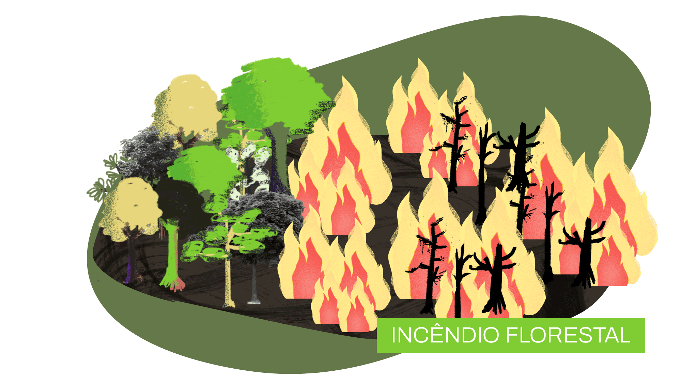
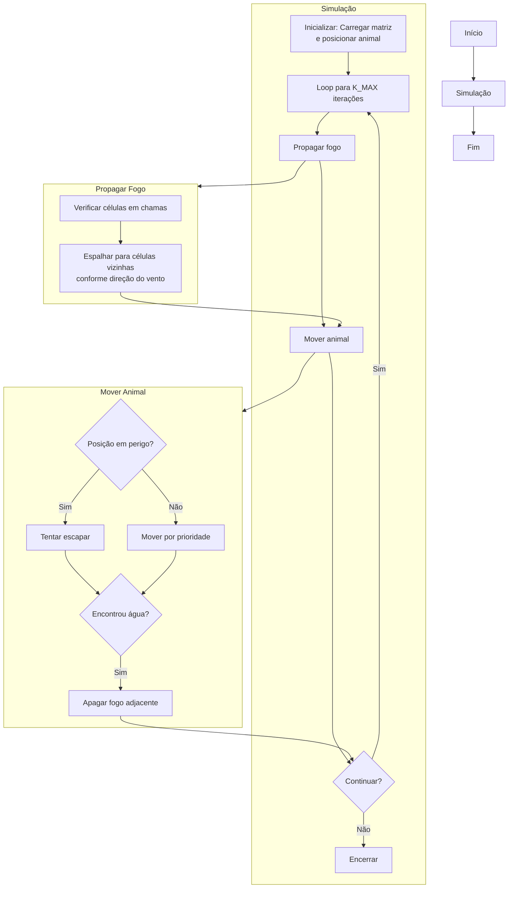

<div align="center">
  <h1>Aquecimento AEDS 1</h1>
  <h3>Simulação de Propagação de Incêndios</h3>
  
</div>

# Introdução  

A propagação de incêndios florestais é um fenômeno crítico, influenciado por fatores como densidade da vegetação, condições climáticas e interações dinâmicas com o ambiente. Este projeto tem como objetivo implementar um **simulador computacional** que modela a expansão do fogo em uma floresta representada por uma matriz, além de incorporar a movimentação inteligente de um animal em busca de rotas de fuga.  

### Descrição do Problema  

A floresta é modelada como uma **matriz dinâmica** de dimensões `N × M`, onde cada célula pode assumir um dos seguintes estados:  
- `0`: Área vazia (não inflamável, segura para o animal).  
- `1`: Árvore saudável (susceptível a pegar fogo).  
- `2`: Árvore em chamas (propaga fogo para vizinhas).  
- `3`: Árvore queimada (não propaga mais fogo).  
- `4`: Fonte de água (extingue fogo e protege áreas adjacentes).

## Objetivos e Desafios  

- **Propagação do Fogo**  
  - Implementar dois modos de propagação:  
    - **Sem vento**: Expansão linear para todas as direções ortogonais (configurável via `config.hpp` com todas as direções `true`)
    - **Com vento**: Direcionamento preferencial (configurável via `config.hpp`).  
  - Garantir que árvores em chamas (`2`) se tornem queimadas (`3`) após um ciclo.  

- **Movimentação do Animal**  
  - Priorizar movimentos para células seguras (`0`), água (`4`), ou evitar fogo (`2`).  
  - Oferecer "segunda chance" de movimento se o animal for atingido pelo fogo.  
  - Registrar trajetória, passos e eventos críticos (ex: morte do animal).  

- **Eficiência Computacional**  
  - Utilizar estruturas de dados otimizadas (e.g., `vector<vector<int>>` para a matriz).  
  - Garantir desempenho escalável para matrizes grandes (ex: `100x100`).

## 🖥️ Ambiente de Criação

O código foi desenvolvido utilizando as seguintes ferramentas:

[](https://www.w3schools.com/cpp/)
[](https://code.visualstudio.com/docs/?dv=linux64_deb)
[](https://ubuntu.com/)

## ⚙️ Ambiente de Compilação

O projeto foi compilado utilizando a ferramenta abaixo:

[](https://www.gnu.org/software/make/)

## 📁 Estrutura de Diretórios
## 📁 Estrutura de Diretórios

```text
📦 aquecimento_aeds
├── 📂 build                 # Arquivos temporários da compilação
├── 📂 data                  # Arquivos de entrada e saída
│   ├── input.dat           
│   └── output.dat.cpp      
├── 📂 img                   # GIFs e imagens do README
├── 📂 src                   # Código-fonte (.cpp e .h)
│   ├── main.cpp             # Arquivo principal
│   ├── simulacao.cpp        # Lógica da simulação
│   ├── simulacao.hpp        
│   ├── config.hpp           
│   ├── leitura_escrita.cpp  # Leitura e escrita
│   └── leitura_escrita.hpp  
├── 📄 Makefile              # Script de compilação
├── 📄 README.md             # Documentação do projeto
```

## Direções do Vento e numero de interações

A propagação do fogo é diretamente afetada pela configuração do vento no arquivo `config.hpp`. Cada direção corresponde a um movimento ortogonal específico na matriz, simulando como o vento "empurra" as chamas. Abaixo está a explicação detalhada de cada parâmetro:  

### 1. **`northWind` (Vento Norte)**  
- **Efeito**: Permite que o fogo se propague para **cima** (direção norte).  
- **Comportamento na Matriz**:  
  - Se uma célula em chamas `(i, j)` tem `northWind = true`, ela irá incendiar a célula acima: `(i-1, j)`.  
  - Exemplo:  
    ```cpp
    const bool northWind = true;  // Fogo se espalha para cima
    ```  
- **Cenário Típico**: Simula um vento soprando **do sul para o norte**, acelerando a propagação em direção ao topo da matriz.  

---

### 2. **`eastWind` (Vento Leste)**  
- **Efeito**: Permite que o fogo se propague para a **direita** (direção leste).  
- **Comportamento na Matriz**:  
  - Se uma célula em chamas `(i, j)` tem `eastWind = true`, ela irá incendiar a célula à direita: `(i, j+1)`.  
  - Exemplo:  
    ```cpp
    const bool eastWind = true;   // Fogo se espalha para direita
    ```  
- **Cenário Típico**: Simula um vento soprando **do oeste para o leste**, comum em regiões costeiras.  

---

### 3. **`southWind` (Vento Sul)**  
- **Efeito**: Permite que o fogo se propague para **baixo** (direção sul).  
- **Comportamento na Matriz**:  
  - Se uma célula em chamas `(i, j)` tem `southWind = true`, ela irá incendiar a célula abaixo: `(i+1, j)`.  
  - Exemplo:  
    ```cpp
    const bool southWind = true;  // Fogo se espalha para baixo
    ```  
- **Cenário Típico**: Simula um vento soprando **do norte para o sul**, comum em áreas montanhosas.  

---

### 4. **`westWind` (Vento Oeste)**  
- **Efeito**: Permite que o fogo se propague para a **esquerda** (direção oeste).  
- **Comportamento na Matriz**:  
  - Se uma célula em chamas `(i, j)` tem `westWind = true`, ela irá incendiar a célula à esquerda: `(i, j-1)`.  
  - Exemplo:  
    ```cpp
    const bool westWind = true;   // Fogo se espalha para esquerda
    ```  
- **Cenário Típico**: Simula um vento soprando **do leste para o oeste**, típico em zonas de alta pressão.  

---

### Combinações de Vento  
- **Vento Omnidirecional** (padrão):  
  ```cpp
  const bool northWind = true;
  const bool eastWind = true;
  const bool southWind = true;
  const bool westWind = true;
  ```

### Controle de Iterações: A Constante `K_MAX`  

Assim como a configuração do vento, a constante **`K_MAX`**, definida no arquivo `config.hpp`, determina o **número máximo de iterações** que a simulação pode executar. Esse parâmetro é essencial para garantir que a simulação não entre em loop infinito e para comparar desempenho em diferentes cenários.  

### Funcionalidade da `K_MAX`  
- **Limite de Ciclos**:  
  - A simulação é interrompida automaticamente após `K_MAX` iterações, mesmo que ainda haja células em chamas.  
  - Exemplo: Se `K_MAX = 25`, o programa executará no máximo 25 ciclos de propagação e movimentação do animal.  

- **Uso no Código**:  
  - O loop principal da simulação (`simulacao.cpp`) utiliza `K_MAX` como condição de parada:  
    ```cpp
    for(int k = 0; k < K_MAX; k++) {
        // Executa propagação e movimentação
    }
    ```  


### Como Modificar `K_MAX`  
Edite o arquivo `config.hpp` e altere o valor da constante:  
```cpp
const int K_MAX = 50;  // Altere para o número desejado
```

# 📋 Metodologia  

### **Abordagem Geral**  
O projeto foi desenvolvido seguindo uma abordagem **modular e iterativa**, priorizando:  
**Clareza de Código**: Divisão em funções especializadas (`simulacao()`, `interation()`, `moverAnimal()`).  
**Eficiência Computacional**: Uso de estruturas de dados otimizadas (`vector<vector<int>>` para matriz dinâmica).  


### **Etapas do Desenvolvimento**  

#### 1. **Modelagem da Floresta**  
- **Matriz Dinâmica**: Representação da floresta via `vector<vector<int>>`, permitindo redimensionamento conforme o `input.dat`.  
- **Estados das Células**: 

#### 2. **Leitura de Dados**  
- **Arquivo `input.dat`**:  
  - Leitura das dimensões da matriz, posição inicial do fogo e configuração do ambiente.  
  - Validação implícita (ex: células fora dos limites são ignoradas).  

#### 3. **Propagação do Fogo**  
- **Lógica por Iteração**:  
  - Criação de uma cópia da matriz (`novaMatriz`) para evitar alterações conflitantes durante a mesma iteração.  
  - Propagação condicional baseada em `config.hpp` (direção do vento).  
  - Atualização de células em chamas para queimadas após 2 ciclos.  

#### 4. **Movimentação do Animal**  
- **Priorização de Rotas**:  
  - Busca por água (`4`) → árvores saudáveis (`1`) → áreas vazias (`0`) → árvores queimadas (`3`).
  - Caso o animal encontre água, todas as celulas vizinhas em chama se apagam, tornando-as árvores saudáveis(`1`).
  - Mecanismo de "segunda chance" se o animal for atingido pelo fogo.  
- **Registro de Dados**:  
  - Passos, posições visitadas e eventos críticos salvos no `output.dat`.
    

#### 5. **Escrita de Resultados**  
- **Arquivo `output.dat`**:  
  - Gravação do estado da matriz a cada iteração.  
  - Relatório final com posição, passos e status do animal.  

---

---

### **Decisões de Design**  
- **Tupla para o Animal**:  
  - Uso de `tuple<int, int, int, int>` para armazenar posição (`x`, `y`), passos e estado em uma única estrutura.  
- **Vetor de Propagação**:  
  - `vector<tuple<int, int, int>>` para rastrear células em chamas e seu tempo de queima.  
- **Configuração Global**:  
  - Parâmetros em `config.hpp` para facilitar ajustes sem recompilar o código-fonte.  

---

### **Limitações Conhecidas**  
- **Performance em Matrizes Muito Grandes**:  
  - Complexidade O(N²) por iteração pode ser custosa para matrizes > 1000x1000.  
- **Interface Não Interativa**:  
  - Não há opção de pausar/retomar a simulação ou ajustar parâmetros em tempo real.  

Esta metodologia garantiu um equilíbrio entre **fidelidade às especificações**, **eficiência** e **organização de código**. 🔥📊  
---

### **`simulacao()`** (`simulacao.cpp`)  
**Propósito**: Função principal que gerencia o fluxo completo da simulação.  
**Funcionalidades**:  
- Lê o arquivo `input.dat` para obter a matriz inicial e parâmetros.  
- Inicializa a posição do animal (via `setPosAnimal()`).  
- Executa o loop principal por `K_MAX` iterações.  
- Chama `interation()` para propagar o fogo e `moverAnimal()` para atualizar a posição do animal.  
- Exibe a matriz atualizada a cada iteração (via `showMatrix()`).  
- Grava resultados no `output.dat`.  

**Função principal**:  
```cpp
void simulacao(){
    int lineSize = 0, columSize = 0, fireStart_X = 0, fireStart_Y = 0;
    string linha;
    ifstream input =  abrirArquivo(); //funcao abrirArquivo() retorna um um ponteiro do tipo ifstream
    ifstream output = abrirSaida();
    bool stop;

    vector<tuple<int, int, int>> propag;

    tuple<int, int, int, int> animal; //posx, posy, passos, quantas vezes ta parado na mesma posição

    if (!input) { // verifica se o arquivo foi aberto corretamente
        cout << "Erro ao abrir o arquivo: " << "../input.dat" << endl;
        return;
    }
    if (!output) { // verifica se o arquivo foi aberto corretamente
        cout << "Erro ao abrir o arquivo: " << "../output.dat" << endl;
        return;
    }
    input >> lineSize >> columSize; //leitura do tamanho da matriz
    input >> fireStart_X >> fireStart_Y; //leitura da posicao do animal
    getline(input, linha); // descarta o restante da linha
    
    vector<vector<int>> inicialMatrix = lerMatriz(input, lineSize, columSize); //leitura da matriz
    animal = setPosAnimal(inicialMatrix,lineSize, columSize); 
    
    for(int k = 0; k < K_MAX; k++){
        cout << "\nInteracao: " << k + 1 << endl;
        stop = interation(inicialMatrix, lineSize, columSize, fireStart_X, fireStart_Y, propag, k); 
        moverAnimal(animal, inicialMatrix, lineSize, columSize);
        showMatrix(inicialMatrix, lineSize, columSize, k);
        if(!stop){
            {
                if(get<3>(animal) != -1){
                    ostringstream oss;
                    oss << "Animal parou na posição x: " << get<0>(animal) << " y: " << get<1>(animal) << " com " << get<2>(animal) << " passos.\n";
                    escreverNoOutput(oss.str());
                }
                else{
                    ostringstream oss;
                    oss << "Animal morreu na posição x: " << get<0>(animal) << " y: " << get<1>(animal) << " com " << get<2>(animal) << " passos.\n";
                    escreverNoOutput(oss.str());
                }
            }
            break;
        }

    }
    input.close();
    output.close();

    return;
}
```
***Fluxograma de decições:***


---

# 🧪 Casos de Teste

Temos aqui um exemplo de uma matriz 8x8, a primeira linha é referente aos dados da matriz, sendo os dois primeiros números as dimensões linhas e colunas, respectivamente, já os dois últimos numéros as cordenadas do ínicio do íncendio, para esse teste temos o fogo se propagando para todas as direções ortogonais

### Arquivo de Entrada (`input.dat`)  
```plaintext
8 8 2 3 // Matriz 8x8, fogo inicia em (linha=2, coluna=3)
1 0 4 1 0 4 4 1
1 0 4 4 1 0 1 0
0 0 1 2 0 4 4 4
4 1 1 1 4 4 1 0
0 1 1 1 1 0 0 4
4 4 4 4 4 1 1 1
1 4 0 0 1 4 4 0
0 4 1 4 4 0 4 4
``` 

***🔥 Análise Detalhada por Iteração***

### **Iteração 1**  
- **Fogo em (2,3)**:  
  - Propaga-se para todas as direções ortogonais (norte, sul, leste, oeste).  
  - Células adjacentes `(1,3)`, `(3,3)`, `(2,2)`, `(2,4)` viram `2` (em chamas).  
- **Animal**:  
  - Inicia em `(7,5)` (célula segura `0`).  
  - Move-se para `(6,7)` (prioriza água `4` na direção sul, convertendo-a para `0`).  
``` plaintext

1 0 4 1 0 4 4 1 
1 0 4 4 1 0 1 0 
0 0 2 2 0 4 4 4 
4 1 1 2 4 4 1 0 
0 1 1 1 1 0 0 4 
4 4 4 4 4 1 1 1 
1 4 0 0 1 0 4 0 
0 4 1 4 4 0 4 4 
```
### **Iteração 2**  
- **Fogo**:  
  - Células em chamas da iteração 1 (`2`) viram queimadas (`3`).  
  - Novos focos em `(3,3)`, `(1,3)`, `(2,2)`, `(2,4)`.  
- **Animal**:  
  - Move-se para `(5,7)` (passos: 2), área segura (`0`).  

``` plaintext

1 0 4 1 0 4 4 1 
1 0 4 4 1 0 1 0 
0 0 2 3 0 4 4 4 
4 1 2 2 4 4 1 0 
0 1 1 2 1 0 0 4 
4 4 4 4 4 1 1 1 
1 4 0 0 1 0 0 0 
0 4 1 4 4 0 4 4 
```
### **Iteração 3**  
- **Fogo**:  
  - Propaga-se para células adjacentes de `(3,3)`, `(1,3)`, `(2,4)`.  
  - Células `(4,3)`, `(3,2)`, `(3,4)` viram `2`.  
- **Animal**:  
  - Mantém-se em `(5,7)` (passos: 3), pois está seguro.  


``` plaintext
1 0 4 1 0 4 4 1 
1 0 4 4 1 0 1 0 
0 0 3 3 0 4 4 4 
4 2 2 3 4 4 1 0 
0 1 2 2 2 0 0 4 
4 4 4 4 4 1 1 1 
1 4 0 0 1 0 0 0 
0 4 1 4 4 0 0 4 

```

### **Iteração 4**  
- **Fogo**:  
  - Células queimadas (`3`) não propagam mais.  
  - Foco restante em `(4,3)` propaga para `(5,3)`.  
- **Animal**:  
  - Continua em `(5,7)` (passos: 4).  

```plaintext
1 0 4 1 0 4 4 1 
1 0 4 4 1 0 1 0 
0 0 3 3 0 4 4 4 
4 2 3 3 4 4 1 0 
0 2 2 3 2 0 0 4 
4 4 4 4 4 1 1 1 
1 4 0 0 1 0 0 0 
0 4 1 4 4 0 0 0 
```

### **Iteração 5**  
- **Fogo**:  
  - Últimas células em chamas (`(5,3)`) viram queimadas (`3`).  
- **Animal**:  
  - Permanece em `(5,7)` (passos: 5).  
```plaintext
1 0 4 1 0 4 4 1 
1 0 4 4 1 0 1 0 
0 0 3 3 0 4 4 4 
4 3 3 3 4 4 1 0 
0 2 3 3 3 0 0 4 
4 4 4 4 4 1 1 1 
1 4 0 0 1 0 0 0 
0 4 1 4 4 0 0 0 
```


### **Iteração 6**  
- **Fogo**:  
  - Nenhuma célula em chamas restante. Simulação encerrada.  
- **Animal**:  
  - **Posição final**: `(5,7)` (passos: 6).  
  - **Status**: Vivo (célula segura `0`).  
```plaintext
1 0 4 1 0 4 4 1 
1 0 4 4 1 0 1 0 
0 0 3 3 0 4 4 4 
4 3 3 3 4 4 1 0 
0 3 3 3 3 0 0 4 
4 4 4 4 4 1 1 1 
1 4 0 0 1 0 0 0 
0 4 1 4 4 0 0 0 
```
### **Conclusão da simulação**  
- **Simulação Correta**: O fogo propagou-se conforme as regras, e o animal encontrou uma rota segura.  
- **Desempenho**: 6 iterações para extinção total do fogo.

#### 📝 ***Observação: Para reproduzir, certifique-se de que `config.hpp` tenha todas as direções do vento ativas (`northWind = eastWind = southWind = westWind = true`).*** 
---
# Compilação e Execução

A estrutura árvore disponibilizada possui um arquivo Makefile que realiza todo o procedimento de compilação e execução. Para tanto, temos as seguintes diretrizes de execução:


| Comando                |  Função                                                                                           |                     
| -----------------------| ------------------------------------------------------------------------------------------------- |
|  `make clean`          | Apaga a última compilação realizada contida na pasta build                                        |
|  `make`                | Executa a compilação do programa utilizando o gcc, e o resultado vai para a pasta build           |
|  `make run`            | Executa o programa da pasta build após a realização da compilação                                 |

---
# Conclusão  
Os resultados dos testes foram satisfatórios:  
- **Propagação do Fogo**: Ocorreu conforme as regras definidas, com transição adequada entre estados (saudável → em chamas → queimada) e influência configurável do vento.  
- **Movimentação do Animal**: Seguiu a ordem de prioridade estabelecida (água → árvore saudável → área vazia), com mecanismo de segunda chance funcional.  

O simulador demonstrou ser uma ferramenta robusta para analisar padrões de propagação e estratégias de fuga em tempo real.  
## Melhorias Futuras  

###Posicionamento Inteligente do Animal
Implementar uma função para definir a posição inicial do animal **o mais distante possível do fogo inicial**, utilizando a **distância de Manhattan**.  


---
# Autores

Este projeto foi desenvolvido por Álvaro Silva como parte da disciplina Algoritmos e Estrutura de Dados I.
Fico à disposição para dúvidas, sugestões ou colaborações. Sinta-se à vontade para entrar em contato!


<a href="https://www.linkedin.com/in/alvarosilvamg/">

</a>

</div>

<p> </p>


<a style="color:black" href="mailto:alvaro.ajsilva@gmail.com?subject=[GitHub]%20Source%20Dynamic%20Lists">
✉️ <i>alvaro.ajsilva@gmail.com</i>
</a>
